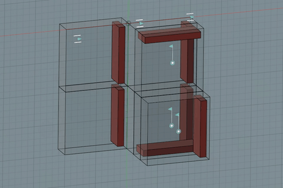
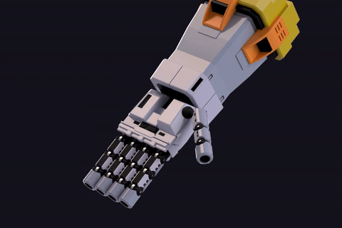

# Fusion360 JointAnimation 

This is Autodesk Fusion360 script to export/restore state of joints to/from CSV file. 

It also automatically animates and renders the model (w/ or w/o raytracing).

[(Japanese document 日本語版)](./README.jp.md)

---

## Installation :

To install, download and extract the zip file, then copy the "JointAnimation" folder to the Fusion360 script folder.

On Windows:

%appdata%\Autodesk\Autodesk Fusion 360\API\Scripts.

On macOS:

~/Library/Application Support/Autodesk/Autodesk Fusion 360/API/Scripts.

see [official howto](https://knowledge.autodesk.com/support/fusion-360/troubleshooting/caas/sfdcarticles/sfdcarticles/How-to-install-an-ADD-IN-and-Script-in-Fusion-360.html).

## Usage :
- Launch the "script and add-in" in the "Tools" tab, within "Add-in".

## Examples :
 \[[mp4](./7seg_2.mp4)\]

 \[[mp4](./zeong_hand2.mp4)\]

## License :
Apache 2.0
